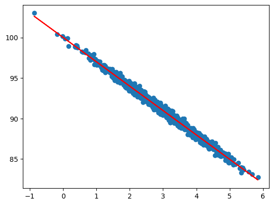

# 数据挖掘技术工具

本文大部分都是参考了《Python数据科学与机器学习：从入门到实践》一书。

数据挖掘的一般过程：数据获取 - 数据分析和预处理（包括特征工程）- 建模及评估 - 模型部署 - 模型监控。

# 数据获取

数据是数据挖掘过程中必要的输入，获取数据的途径有：

- 项目自有数据
  一般在做数据挖掘项目的时候，可以获取到项目数据
- 公开/共享数据
  有一些公开/共享的数据，可以进行数据挖掘的实验
- 模拟数据
  可以使用生成工具生成模拟的数据，numpy中有一些随机数据的生成算子

## 项目自有数据

具体情况还有具体分析，不讨论。

## 公开/共享数据

比如UCI网站上可以找到一些，如气象数据之类没有隐私问题的数据应该容易获取。

## 模拟数据

numpy提供了一些随机数据生成的算子，参考[模拟数据生成](./数据获取/模拟数据生成.ipynb)

# 数据分析和预处理

基于统计的手段可以大致了解数据的分布，比如均值、中位数、众数都是试图用一个数值代表所以数据，标准差和方差描述了数据的分散程度，百分位更细致的描述了数据在不同段的分布情况等，参考[数据统计](./数据分析/数据统计.ipynb)。统计除了有助于了解数据，还能用于数据处理、特征选择等，比如使用均值/中位数来填充缺失值，使用百分位来检测离群点，使用相关系数来选择特征等。

通过可视化的技术手段可以对数据有更直观的理解，比如说数据的分布，使用直方图比单纯的统计数字更有助于理解，Matplotlib是python中经典的数据可视化包，参考[可视化分析-基于Matplotlib](./数据分析/可视化分析-基于Matplotlib.ipynb)。

# 建模

机器学习问题可大致分为有监督、无监督，其中有监督问题是指已有数据中包含目标标签，比如在信用卡逾期的预测问题中，我们已有一批数据包括逾期的客户和未逾期的客户；反之数据中没有目标标签的问题则为无监督问题，比如对异常数据的检测，只是提供一批数据，并没有哪个数据异常的先验知识。

有监督问题可进一步细分为分类、回归、时序预测，无监督问题可进一步细分为聚类、异常检测。这是我目前为止所了解到的问题分类，可能不全，也可能会有新的问题出现。

分类问题是对类别型字段进行预测，比如客户是否流失 - 是 或 否，这是二分类问题；一本书应该属于文学类、传记类、科学类还是其他，这是属于多分类问题。回归是对数值类型进行预测，比如根据附近小区的房子成交记录，预测其他房子的成交价。时序预测是回归问题中特殊的一种，相比于一般的回归问题它特别关注时间属性，比如对路口车流量的预测，考虑到上下班的早、晚高峰，节假日的情况，时间对最终的预测结果会有很大影响。

聚类问题是将已有的数据划分为指定的n类，比如可以通过用户的位置信息为连锁餐饮机构提供新店选址 -- 选择最大簇或者每一个簇中最中心的点。异常检测问题是一种挖掘非正常数据的技术，可用于信用卡盗刷、异常流量检测等场景。

建模的目标是根据已有的数据，通过机器学习技术手段建立可预测的模型，该模型可用于对新的数据进行预测。

## 回归问题

### 线性回归

通过直线建模来挖掘自变量x和因变量y的关系，最终模型可以通过给定的x输出预测的y结果。

参考：[线性回归](./建模/线性回归.ipynb)

### 多项式回归

通过曲线建模来挖掘自变量x和因变量y的关系，最终模型可以通过给定的x输出预测的y结果。

参考：[多项式回归](./建模/多项式回归.ipynb)

### 多元回归

参考：[多元回归](./建模/多元回归.ipynb)
